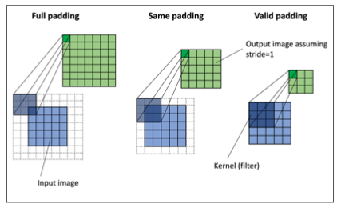

# Errata

## Chapter 1

- pg 10: 5th row from the bottom, x^{(i)} \epsilon \mathbb{R}^{150 x 1}, should be x_{j} \epsilon \mathbb{R}^{150 x 1}. (Was correct in the 2nd edition.)

## Chapter 2

- pg 25: the superscripts (i) in $ \Delta w_{j}=\left(1^{(i)}-(-1)^{(i)}\right) 2^{(i)}=(2) 2^{(i)}=4 $ were initially used for illustration purposes in previous editions but are not necessary and could/should be removed

- pg. 42: It should be "eta=0.01" instead of "eta=0.1" in the sentence

> So, let's choose two different learning rates, eta = 0.1 and eta = 0.0001, to start with and plot the cost functions versus the number of epochs to see how well the Adaline implementation learns from the training data.

- pg. 45: Arrows should be perpendicular to the contour lines.

## Chapter 3

- pg. 55 & 56: Says `print('Labels counts ...` in code, but "labels counts" is grammatically wrong and should be "label counts."

- pg. 56: The comment about the `n_iter` method can be ignored as it does not apply to recent scikit-learn versions (0.21 and newer)

- pg. 84: It says "XOR gate using the `logical_or` function from NumPy, " near the bottom, but it should be `logical_xor` instead of `logical_or`

## Chapter 5

- pg. 162. In `S_i = \sum_{x in D_i} (x - m_i) (x - m_i)^{\top}`, the transpose should be on the first row vector, i.e., `S_i = \sum_{x in D_i} (x - m_i)^{\top} (x - m_i)`.


## Chapter 8

- In tokenizer, change `text.lower()` to `text`, i.e.,

```python
emoticons = re.findall('(?::|;|=)(?:-)?(?:\)|\(|D|P)', text)
```
to catch emoticons such as ":-P"

## Chapter 13

- pg. 469: Instead of `tf.keras.activations.tanh(z)` it should be `tf.keras.activations.relu(z)`.

## Chapter 15

- pg. 524: "valid" and "same" are swapped in the figure here. You can use the 2D version of this figure from the 2nd edition as reference, where this is correct:



- pg. 526, to be more consistent with the text and cover a more general scenario (where padding is not `'same'`), the line `for i in range(0, int(len(x)/s), s):` in the `conv1d` function could be changed to  `for i in range(0, int((len(x_padded) - len(w_rot)) / s) + 1, s):`

## Chapter 18

- pg. 682: in "Episode 2", there are some wrong index values for G. The subscript of G should match the value of t. E.g., where t=1, it should be G1, not G0.
- pg. 713: Not a code error, but the line `self.enf = env` could be changed to `self.env = env` to look more consistent
