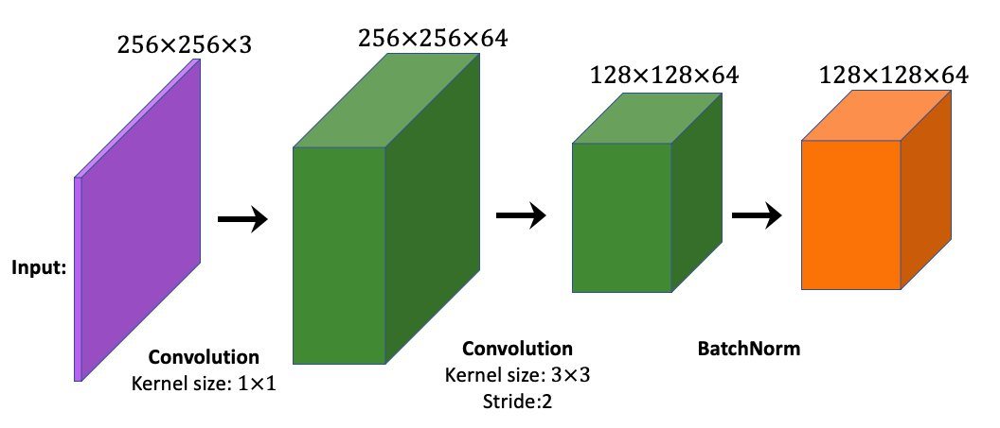

# Chapter 15 Exercises

1. What is the total number of learnable parameters in the following CNN block? This block consists of two convolutional layers followed by a BatchNorm layer.

## Related but Beyond Scope

*Exercises in this section cannot be answered by just reading the chapter and require further reading and research.*
